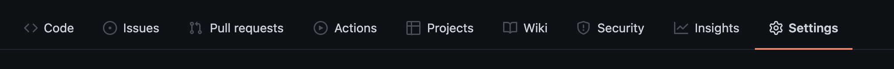
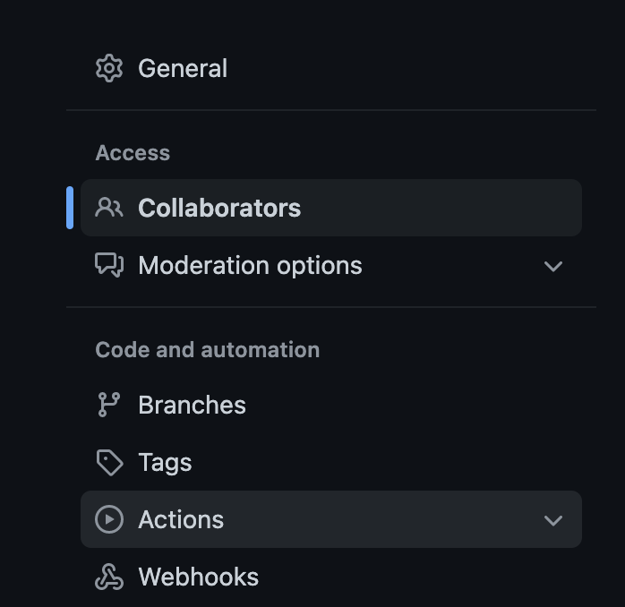
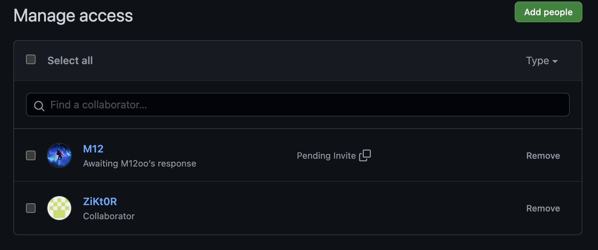
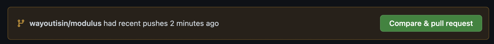
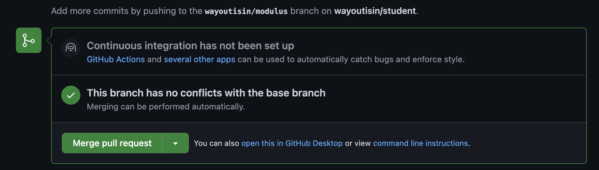

# 🏆 Review a PR & Ignore unwanted files
In the last week's (week-12) exercise we pushed changes from a user branch to GitHub repository. In the process of pushing the changes from user branch to main (master), we would like to ensure that someone can review the code changes and approve or suggests improvements. All of this is handled through Pull Requests. As Pull Request or PR in short is a way to pull changes from one branch to another in this case from user branch to main.  

This week we will look at how a PR is reviewed and the changes are finally merged. In addition we will also take a look at how to ignore files that are temporary in nature and should not be pushed to GitHub.

# ✅ Prerequisites
I assume you have completed tasks from week-2

# 🤸 Let's get started
- Open your GitHub profile page at https://github.com
- On the right hand corner, click on your profile icon.
- Select the option "Your repositories"
- Select the repository you would like to work on (`tools`)
- In the repository page, select "Settings" option
  
- On the left panel choose "Collaborators"
  
- Add people you would like to be collaborators in this repository. Use individual GitHub handle to add users to the repository
    
- Added users would receive an invitation to join the rspository as a collaborator. Once they do, they can start contributing to the respository starting with reviewing the PR(s).They would have received the invitation.
- Open a command prompt or terminal window on your machine 
- Go to the `tools` folder
- You can open `vscode` from the current directory using the command below. The "." here represents the current directory you are in, while ".." represents the parent directory

    ```
    code .
    ```
- Create a user branch from master. The user branch is created from the local master branch. As such before we create the user branch we need to make sure that the local master branch is upto date. We do this by executing the following command.
    ```
    git pull origin master
    ```
    ```
    From https://github.com/wayoutisin/tools
    * branch            master     -> FETCH_HEAD
    Already up to date.
    ```
- We can see that our local master branch has all the changes from GitHub.
- Next we create a user branch from our local master branch
    ```
    git checkout -b wayoutisin/week-3
    ```
- On the prompt you will see the message as 
    ```
    Switched to a new branch 'wayoutisin/week-3
    ```
- Create a file `power.py` under the `week-3` folder and add a simple function to compute the remainder in a division operation
    ```
    def power(x, y):
    return x**y

    if __name__ == "__main__":
        x = 1
        y = 2
        print(f"{x} ^ {y} = {power(x, y)}")
    ```
-  You can execute the file by starting a Terminal from inside vscode and executing the following command. Please ensure that path to modulus.py is correct.
    ```
    python week-3/power.py
    ```
- A successful execution would show the following results
    ```
    1 % 2 = 1
    ```
- So far our code is in our user branch. We need to commit this change in the user branch before pushing it to GitHub

    ```
    git add .
    git commit -m "Adding modulus function"
    ```
- You can switch to your master branch at this stage and check for yourself that the changes you committed to the user branch are not present in your local master branch.
    ```
    git switch master

    # Switch back to the user branch
    git switch wayoutisin
    ```

- Finally we push our committed code from the local git repository user branch to GitHub using the following command
    ```
    git push origin head
    ```
- This will create a new branch `wayoutisin/modulus` in GitHub. This is important because your changes are now available for someone to review before it can be merged to master. However we still need to perform a few steps before the code can be merged to master
- The change would appear on GitHub as below
    
- Click "Compare & pull request" to create a PR. A PR (pull request) is a way to push a change from your local branch to GitHub maain (master) branch
    
- As you can see the code is being moved from the user branch `wayoutisin\modulus` to `master`. We have documented our PR with comments for ease of understanding. Ideally we would also assign reviewers to this PR, who would then review and approve the PR request, however that is an exercise for you to accomplish by next week 😄
- Once the reviewers have approved the PR request, we can merge the pull request using the "Merge pull request" option
    

- Finally after merging our changes to the main (master) branch in GitHu, we should refresh our local master branch using the command 
    ``` 
    git pull origin master
    ```
-  Why do we need to review the PR? Well when working in a large team with multiple developers we would like to have a process to ensure only quality code gets into the main branch (master). One way to ensure that is PR.
-  What do you with the user branch? You can drop 🗑️ the user branch both locally or on GitHub once you have merged your changes to main (master). Also remember when your PR is active you can make multiple changes to your local branch and push it to master. They will all be collected under the active PR you have in GitHub till it is merged to main (master) or closed.

    ```
    git branch -d wayoutisin/modulus
    ```
# 🤔 Exercise
Here are 2 exercise for you for the week 
- Add a few members to your GitHub repository and assign the PR to them for review before merging to main (master)
- Create one program each of the next 6 days. Choose a name for each file and stor it a separate `{name}.py` file in the week-2 folder. Use the workflow learnt here to push your code to GitHub from local machine. 