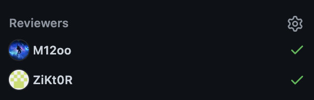
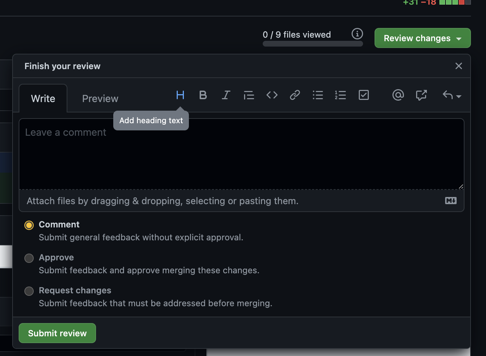
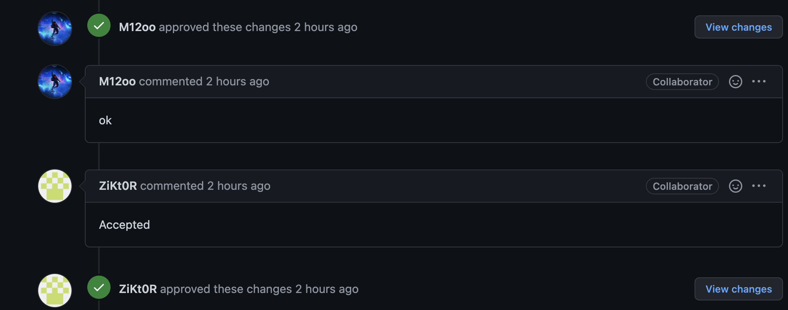
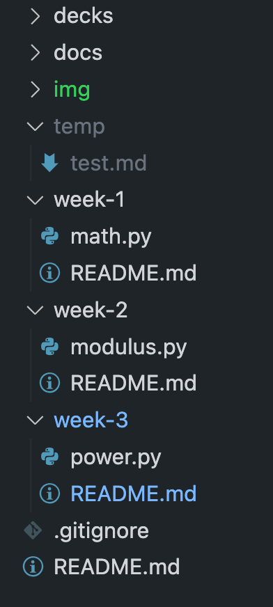

# 🏆 Review a PR & Ignore unwanted files
In the last week's (week-12) exercise we pushed changes from a user branch to GitHub repository. In the process of pushing the changes from user branch to main (master), we would like to ensure that someone can review the code changes and approve or suggests improvements. All of this is handled through Pull Requests. As Pull Request or PR in short is a way to pull changes from one branch to another in this case from user branch to main.  

This week we will look at how a PR is reviewed and the changes are finally merged. In addition we will also take a look at how to ignore files that are temporary in nature and should not be pushed to GitHub.

# ✅ Prerequisites
I assume you have completed tasks from week-2

# 🤸 Let's get started

## PR Review
- Open your GitHub profile page at https://github.com
- On the right hand corner, click on your profile icon.
- Select the option "Your repositories"
- Select the repository you would like to work on (`tools`)
- In the repository page, select "Settings" option
  
- On the left panel choose "Collaborators"
  
- Add people you would like to be collaborators in this repository. Use individual GitHub handle to add users to the repository
    
- Added users would receive an invitation to join the rspository as a collaborator. Once they do, they can start contributing to the respository starting with reviewing the PR(s).They would have received the invitation.
- Open a command prompt or terminal window on your machine 
- Go to the `tools` folder
- You can open `vscode` from the current directory using the command below. The "." here represents the current directory you are in, while ".." represents the parent directory

    ```
    code .
    ```
- Create a user branch from master. The user branch is created from the local master branch. As such before we create the user branch we need to make sure that the local master branch is upto date. We do this by executing the following command.
    ```
    git pull origin master
    ```
    ```
    From https://github.com/wayoutisin/tools
    * branch            master     -> FETCH_HEAD
    Already up to date.
    ```
- We can see that our local master branch has all the changes from GitHub.
- Next we create a user branch from our local master branch
    ```
    git checkout -b wayoutisin/week-3
    ```
- On the prompt you will see the message as 
    ```
    Switched to a new branch 'wayoutisin/week-3
    ```
- Create a file `power.py` under the `week-3` folder and add a simple function to compute the remainder in a division operation
    ```
    def power(x, y):
    return x**y

    if __name__ == "__main__":
        x = 1
        y = 2
        print(f"{x} ^ {y} = {power(x, y)}")
    ```
-  You can execute the file by starting a Terminal from inside vscode and executing the following command. Please ensure that path to modulus.py is correct.
    ```
    python week-3/power.py
    ```
- A successful execution would show the following results
    ```
    1 ^ 2 = 1
    ```
- So far our code is in our user branch. We need to commit this change in the user branch before pushing it to GitHub

    ```
    git add .
    git commit -m "Adding power function"
    ```

- Finally we push our committed code from the local git repository user branch to GitHub using the following command
    ```
    git push origin head
    ```
- This will create a new user branch `wayoutisin/week-3` in GitHub. You can visit GitHub and see a new user branch created.
- Click "Compare & pull" to create a PR as we did the last week. Remember giving a good description of your changes in the PR comments section (markdown) 
- Now you can assign users to review your PR
  
- Once the reviewers look at the changes they can choose to Comment, Approve or Request Changes in the PR.
    
- If the PR is approved by the reviewers you would be notified about it and would be able to see it on the PR page as well. 
    
- Once the reviewers have approved the PR request, we can merge the pull request using the "Merge pull request" option. In an ideal scenario we wouldn't see the "Merge pull request" option unless all of the required reviewers have approved the PR, however we are using a simple scenario for demonstration

- Post the PR is merged the PR closes by default and you would get an option to delete the user branch created in GitHub.You can delete the user branch.
  
  

- Finally after merging our changes to the main (master) branch in GitHub, we should refresh our local master branch using the command 
    ``` 
    git pull origin master
    ```

## Ignore unwanted files
Often you may have temporary files in you local repository that you don't want to be pushed to GitHub. Some of these files may have been created intentionally example files containing data (.csv) which may be required for experimenting with code locally but not in the final version of the code in GitHub. Or sometime OS creates certain hidden files e.g. .DS_Store, or cache files created when you use Jupyter notebook.

In order to avoid these files being tracked by git we add a file to our source code directory preferrably at the root folder as `.gitignore'. You can then add any regex to exclude any files and folders from being tracked by git. Here is a sample file that we added to exclude `.DS_Store` hidden file and all content including folder temp

```
.DS_Store
/temp
```
- To see this in action add a folder called temp in the root node of your repository
- You may have to execute the command once if and only if you had created the repository with a temp directory before you added the `.gitignore` file. The '.' in the command represents the current directory
  ```
  git rm -r --cached .
  ```
- After adding the `.gitignore` in your source directory, you can see the folder unhighlighted in vscode
  
- If you tried to now add changes to your repository using `git add .`, you can check the status of changes using `git status` as below. Notice that the temp directory is not included as part of the changes since we added it to `.gitignore`
  ```
  On branch wayoutisin/gitignore
    Changes to be committed:
  (use "git restore --staged <file>..." to unstage)
	deleted:    .DS_Store
	new file:   .gitignore
  ```
- The changes can now be committed and pushed to GitHub user branch using the same workflow that we have seen before. 
- Finally the changes can be merged to main (master) after PR review. These changes can then be pulled down to your local main(master) using 
  ```
  git pull origin master
  ```

# 🤔 Exercise
- Read the 1-4 chapters of the book "GitPro" available [here](https://git-scm.com/book/en/v2)
- You can find a standard template of `.gitignore` for python [here](https://github.com/github/gitignore/blob/main/Python.gitignore). Include this in one of your projects and experiment to see which files get excluded
